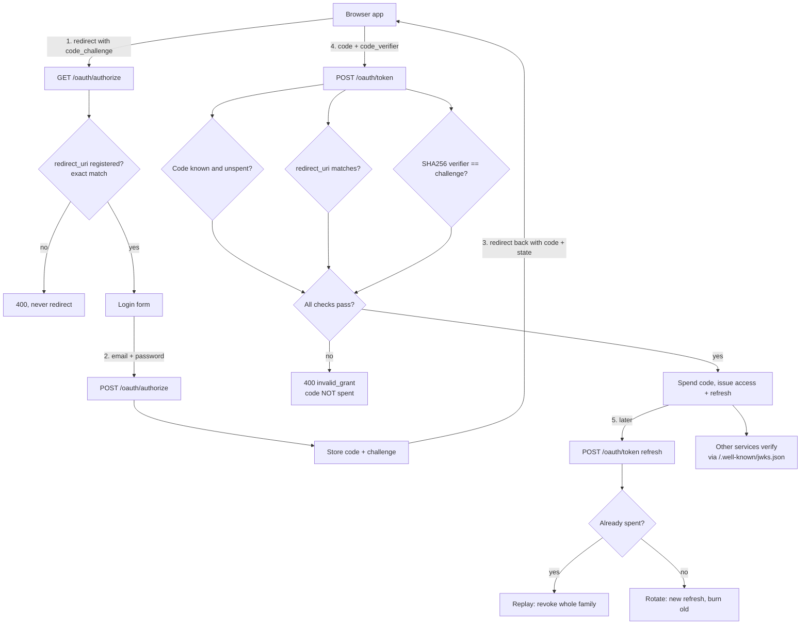

# oauth2-token-service

> An OAuth2 server small enough to read, strict enough to trust

[](https://github.com/Krishna89287/oauth2-token-service/actions)
[](https://nodejs.org)
[](https://www.typescriptlang.org)
[](LICENSE)

Most of us integrate against an OAuth server rather than write one, and that is
usually the right call. The trouble is that it leaves the spec as folklore: you
know you need PKCE, you are less sure what it actually stops, and the difference
between a public and a confidential client is something you look up each time.

So this is the other half of the exercise. It implements the three grants worth
having, and every security rule in it exists because of a specific attack, which
the tests name and carry out.

## What it looks like running

```
$ npm run demo

1. client_credentials, one service talking to another

  status                    200
  scope                     reports:read
  sub                       reporting-service
  refresh_token             none, by design

   asking for more than it is registered for

  status                    400
  error                     invalid_scope
  description               not allowed for this client: admin

2. authorization_code + PKCE, a browser app signing a user in

  redirect                  302 back to the client with a code
  stolen code, own verifier 400 invalid_grant  <- PKCE stops this
  code with verifier        200 access + refresh issued
  sub                       user-1
  same code again           400 invalid_grant  <- single use
  its tokens after that     400 invalid_grant  <- replay revoked them

3. refresh rotation, and what happens when a token is stolen

  honest refresh            200 new refresh token issued
  token changed             true
  thief replays old         400 invalid_grant  <- already spent
  honest client now         400 invalid_grant  <- whole family revoked

   we cannot tell thief from victim, so the chain dies and the user logs in again.

4. anyone can verify a token without holding a secret

  jwks keys                 1
  key type                  RSA RS256
  private half present      false
```

Block 3 is the one worth sitting with. The honest client refreshes and gets a new
token. Then someone replays the old one, which is only possible if they have a copy
they should not. At that point two parties hold tokens from the same chain and
there is no way to tell which is the thief, so both lose. The user signs in again,
which is a far smaller harm than an attacker holding a renewable session forever.

## How it flows



## Getting started

```bash
docker compose up -d          # postgres and the service, migrations run on boot
npm install
npm run migrate -- --seed     # two clients and a user
npm run demo                  # the output above
npm test                      # 144 tests, unit and integration
```

A service asking for a token:

```bash
curl -s -X POST localhost:3000/oauth/token \
  -d grant_type=client_credentials \
  -d client_id=reporting-service \
  -d client_secret=reporting-secret-do-not-use-in-production \
  -d scope=reports:read
```

```json
{
  "access_token": "eyJhbGciOiJSUzI1NiIsImtpZCI6...",
  "token_type": "Bearer",
  "expires_in": 900,
  "scope": "reports:read"
}
```

Endpoints: `/oauth/authorize`, `/oauth/token`, `/oauth/introspect`,
`/.well-known/jwks.json`, `/.well-known/oauth-authorization-server`, `/health`.

## The rules, and the attack each one stops

**PKCE, S256 only, so a stolen code is useless.** The authorization code comes back
through a browser redirect, where another app on the device can read it. The code
alone is not enough: whoever redeems it must also send the verifier whose SHA256
matches the challenge sent at the start, and only the app that began the flow has it.

RFC 7636 also defines `plain`, where the challenge is the verifier in the clear,
and this server refuses it. That is not tidiness. `plain` is a complete bypass of
the thing PKCE is for: the attacker crafts the authorize URL themselves, since
client_id and redirect_uri are public, sets a challenge they chose, lets the victim
log in at the real server, intercepts the code, and redeems it with the verifier
they already have. An earlier version of this accepted `plain`, and the attack
worked end to end. `tests/integration/attacks.test.ts` now runs it and expects a
400. An unrecognised method is rejected too, rather than falling through to a
plain string compare, which was the same hole wearing a different hat.

**A replayed code revokes what it issued.** A code redeemed twice means someone has
a copy of one we already honoured, so the tokens that came out of it may be theirs.
RFC 6749 4.1.2 asks for this, and it is why the demo has to log in again before it
can show refresh rotation.

**A failed verifier does not spend the code.** Every check runs before the code is
consumed. If a wrong verifier burned it, an attacker holding a stolen code could
break the real user's sign in with one bad request, while still never being able to
redeem it themselves. That is a denial of service for free. Single use is decided
by `UPDATE ... WHERE consumed_at IS NULL`, so two racing redemptions cannot both
win, and the loser is treated as a replay.

**Refresh rotation with family revocation.** Every refresh burns the old token and
issues a new one, which is what makes theft detectable at all: a token presented
twice means someone has a copy. Since we cannot tell which party is honest, the
whole family goes. Rotation runs in a transaction with `FOR UPDATE`, because two
concurrent refreshes of the same token are exactly the case being judged.

**No refresh token for client_credentials.** The client already holds credentials
it can reuse whenever it likes, so a refresh token would just be a second, weaker
credential. RFC 6749 4.4.3 says the same.

**Redirect URIs match exactly, never by prefix.** A prefix check on
`https://app.example.com` also accepts `https://app.example.com.evil.tld`. And an
unregistered redirect_uri gets a 400 rendered here, never a redirect, because
redirecting to report the error is itself the open redirect.

**RS256, not HS256.** With a shared secret, every service that can verify a token
can also mint one. With a key pair this service signs and everyone else verifies
using the public key from the JWKS, holding nothing dangerous. A test asserts the
private parameters never appear in that endpoint, because publishing them would be
the worst thing this service could do.

**Refresh tokens are opaque and stored hashed.** A JWT refresh token cannot be
revoked without a list of revoked ones, at which point it is a database lookup with
extra steps. Hashing means a leaked backup is not a set of working credentials.

**Every failure looks the same, including on the clock.** Unknown, expired, revoked
and replayed all return the same `invalid_grant` with the same sentence, for codes
and for refresh tokens. Telling them apart is free information for someone working
through a list of stolen tokens.

The same applies to the login form and to client authentication, and the message
was the easy half. The hard half is timing: the obvious
`user ? await verify(...) : false` never runs scrypt for an account that does not
exist, so a missing address answered in 0.8ms where a real one took 31.4ms. Same
words, 40x apart, one request to learn whether an address is real. A missing account
now verifies against a dummy hash instead, so the answer costs what the truth costs.
There is a test that measures the ratio.

**Scope narrows, it does not escalate.** Asking for more than the client is
registered for is refused, asking for nothing gives everything it is allowed, and a
refresh keeps the scope the login granted.

## What is not here

**The signing key is generated at boot.** Fine for one instance, wrong for more
than one: each would sign with a different key and reject the others' tokens. A
real deployment loads a key pair from a secret manager, and rotates by publishing
the new public key in the JWKS before it starts signing with it. That sequencing is
the whole difficulty and it is not implemented.

**No consent screen.** The login form authenticates the user and goes straight to
issuing a code. A real server shows what is being granted and lets the user refuse.

**No rate limiting.** The login form and the token endpoint are both worth
brute forcing, and neither is protected here. That belongs in front of the app
rather than inside it, but it has to exist somewhere.

**The password grant is not implemented, deliberately.** It hands the user's
password to the client. It is deprecated and I would rather not have it in a repo
someone might copy.

**Stack:** Node.js · TypeScript · Fastify · PostgreSQL · jose · Docker · jest

---

Built by [Krishna Gove](https://github.com/Krishna89287), working on backend and AI systems in Munich.
